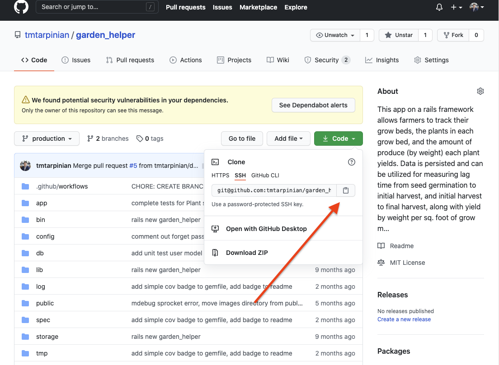

# Garden Helper
> An app to track the life-cycle data of every plant in your garden, greenhouse, or aquaponics system.

### Table of Contents

- [Description](#description)
- [Dependencies](#dependencies)
- [Run](#Run)
- [Resources](#Resources)
    - [Application Controller](#Application)
    - [User Controller](#Users)
    - [Beds Controller](#Beds)
    - [Plants Controller](#Plants)
    - [Harvests Controller](#Harvests)
- [Contributing](#Contributing)
- [Code of Conduct](#Conduct)
- [License](#license)
- [Maintainers](#Maintainer(s))

---

## Description
This program was created to help local farmers track the plants, grow beds, and harvests from their gardens. The app allows a user to create objects representing a grow bed and the plants growing in each respective bed. Additionally, harvests from each plant can be created as objects, relating to both an individual grow bed and plant. The data is persisted in a Postgresql database, which users can access in their account dashboard. The program can be expanded in the future, both allowing for more specific filtering and querying of data as well as implementation of hardware, such as a bar code scanner, improve the speed and accuracy of data input for each plant.

## Dependencies
The following requirements are necessary to run this application:
- Ruby
- Rails
- Postgresql
- Devise
- OmniAuth

### Ruby

These files are written with Ruby and requires Ruby version ~>2.6.1 to be installed on the operating system executing the program.

#### Changing_Versions
If Ruby is installed on your system, verify the currently used version with the command `ruby -v`

You can list all installed Ruby versions on your machine with `rvm list`

Changing the currently used version of Ruby to a version ~>2.6.1 can be achieved with the command `rvm use 2.6.1` (or your specified version).

Running `rvm list` again will confirm that that version is the current

#### Installing_Versions
If you do not have a version of Ruby version  ~>2.6.1 on your machine you, can obtain it by running `rvm install 2.6.1`.

This installation requires `Ruby Version Manager` (RVM). If RVM is not installed on your machine, that can be downloaded and installed with the following command:

`curl -sSL https://get.rvm.io | bash`

When RVM is installed, run `rvm reload` or close and reopen your terminal to make sure RVM is fully loaded. Next, install the Ruby version ~>2.6.1 with the subsequent commands:

`rvm install 2.6.1`
`rvm use 2.6.1`

Please see the [Ruby installation instructions](https://www.ruby-lang.org/en/documentation/installation/) for further information about installing RVM or a Ruby verion on your machine.

### Rails
### Postgresql
### Devise
### OmniAuth

## Run
To use Garden Helper, visit the file's repo on Github.

From there, download a zipped copy of the repo files or use its web url to clone.
 
Please have ruby and rails installed prior to running this application, as well as the [other dependencies listed above](#dependencies).

After unzipping and saving the contents to the desired directory (or using git clone to clone the repo in your terminal), change directories to the directory containing the copy of the repo.

From within that directory, and run `bundle install` to install all the gems required for this program.

From within that directory, run `rails s` in your terminal, then open `localhost:3000` in a web browser.

The program will run and prompt user to sign-up or login.

To close the program, logout of your account, exit your web browser, and press `ctrl + C` in your terminal to exit rails server.

## Resources

The structure of the applications's routes and nested routes [can be viewed here](./config/routes.rb#L3-L21). 
 
### Application
| route | method | description | Docs |
|---|---|---|---|
|  '/' | GET | renders welcome page |  [Rdoc](./app/controllers/application_controller.rb#L5-L11) | 
 
### Users
| route | methods | description |
|---|---|---|
|  'users/signin' | GET, POST | logins instance of a user | 
|  'users/signup' | GET, POST | creates instance of a user | 
 
### Beds
| route | methods | description | Docs |
|---|---|---|---|
|  '/beds' | GET, POST | shows all bed instances of logged in user and/or create new bed instance |  [Rdoc](./app/controllers/beds_controller.rb#L5-L25) |
|  '/beds/new' | GET | renders form to create new bed| [Rdoc](./app/controllers/beds_controller.rb#L27-L34) |
|  '/beds/:id' | GET, PATCH | renders show page for particular bed instance, and/or update instance of a bed | [Rdoc](./app/controllers/beds_controller.rb#L44-L62) |
|  '/beds/:id/edit' | GET | renders form to edit a game instance |  [Rdoc](./app/controllers/beds_controller.rb#L36-L42) |
|  '/beds/:id/plants/new' | GET | renders form to create new instances of a plant | [Rdoc](./app/controllers/plants_controller.rb#L27-L43) |
|'/beds/:id/plants/:id' | GET, UPDATE | shows a single plant instance of a user, updates current instance of a plant | [Rdoc](./app/controllers/plants_controller.rb#L53-L86) |
|  '/beds/:id/plants/:id/edit' | GET | renders an edit form for a single plant instance of a user | [Rdoc](./app/controllers/plants_controller.rb#L45-L51) | 
 
### Plants
|  route | Methods | description  |  Docs |
|---|---|---|---|
|  '/plants' | GET, POST | shows all instances of a user's plants, creates new instance of a plant | [Rdoc](./app/controllers/plants_controller.rb#L4-L25) |
|  '/plants/new' | GET | renders form to create new instances of a plant | [Rdoc](./app/controllers/plants_controller.rb#L27-L43) |
| '/plants/:id' | GET, UPDATE | shows a single plant instance of a user, updates current instance of a plant | [Rdoc](./app/controllers/plants_controller.rb#L53-L86) |
| '/plants/:id/edit' | GET | renders an edit form for a single plant instance of a user | [Rdoc](./app/controllers/plants_controller.rb#L45-L51) | 
 
### Harvests
|  route | Methods | description  |  Docs |
|---|---|---|---|
| '/plants/:id/harvests/new' | GET | renders form to create a new instance of a harvest | [Rdoc](./app/controllers/harvests_controller.rb#L3-L18) |
| '/plants/:id/harvests' | POST | creates a new instance of a harvest | [Rdoc](./app/controllers/harvests_controller.rb#L20-L41) |
| '/plants/:id/harvests/:id/edit' | GET | renders edit form for an instance of a harvest | [Rdoc](./app/controllers/harvests_controller.rb#L43-L63) |
| '/plants/:id/harvests/:id' | GET, UPDATE, DELETE | renders instance of a harvest for a single plant, and/or updates/deletes harvest instance  | [Rdoc](./app/controllers/harvests_controller.rb#L65-L136) |

## Acknowledgements
Thanks to StartBootstrap and David T Miller for the use of their Bootstrap templates.

The navbar and footer of this project were adapted from the html of their "One Page Wonder" template, found here: https://startbootstrap.com/themes/one-page-wonder/ and repo here: https://github.com/StartBootstrap/startbootstrap-one-page-wonder.

The CSS for the body of this project was adapted from the html of their "Creative" template, found here: https://startbootstrap.com/themes/creative/ and repo here: https://github.com/StartBootstrap/startbootstrap-creative.

#### Special thanks to:

[Francesco Gallarotti](https://unsplash.com/@gallarotti) for the photo "Selected Focus of Green Leaf Plant"

[Rob Pumphrey](https://unsplash.com/@robpumphrey) for "Young basil leaves"

[Dan Gold](https://unsplash.com/@danielcgold) for "Tomatoes on the Vine"

[Jon Sailor](https://unsplash.com/@eyefish73) for "Green Bell Pepper"

[Russ Ward](https://unsplash.com/@rssemfam) for "Juannis' Microgreens"

[Christian Joudrey](https://unsplash.com/@cjoudrey) for "Row of Bean Sprout"

## Contributing
Bug reports and pull requests are welcome on GitHub at https://github.com/tmtarpinian/garden_helper. This project is intended to be a safe, welcoming space for collaboration, and contributors are expected to adhere to the Contributor Covenant Code of conduct.

## Conduct
Everyone using and interacting in Garden Helper's code
bases, issue trackers, chat rooms and/or mailing lists is expected to follow the [Code of conduct](./CODE_OF_CONDUCT.md).

## License
Copyright © 2020-21 Trevor Tarpinian

The app is available as open source under the terms of the [MIT License](https://opensource.org/licenses/MIT).
---

## Maintainer(s)
---

|      |
| :------------- | 
|[@tmtarpinian](https://github.com/tmtarpinian) |
