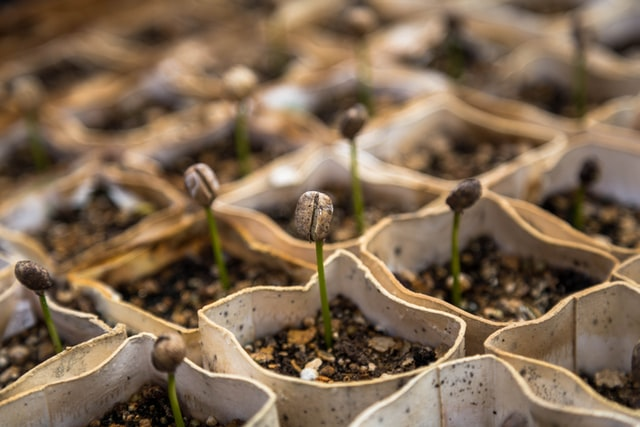

# Garden Helper

> An app to track the life-cycle data of every plant in your garden, greenhouse, or aquaponics system.

### Table of Contents

- [Description](#description)
- [Deploy the App](#Deploy)
- [Resources](#Resources)
    - [Application Controller](#Application)
    - [User Controller](#Users)
    - [Beds Controller](#Beds)
    - [Plants Controller](#Plants)
    - [Harvests Controller](#Harvests)
- [Contributing](#Contributing)
- [Code of Conduct](#Conduct)
- [Maintainers](#Maintainer(s))
- [License](#license)

---

## Description
This program was created to help local farmers track the plants, grow beds, and harvests from their gardens. The app allows a user to create objects representing a grow bed and the plants growing in each respective bed. Additionally, harvests from each plant can be created as objects, relating to both an individual grow bed and plant. The data is persisted in a Postgresql database, which users can access in their account dashboard. The program can be expanded in the future, both allowing for more specific filtering and querying of data as well as implementation of hardware, such as a bar code scanner, improve the speed and accuracy of data input for each plant.

### Technologies
- Ruby
- Rails
- Postgresql
- Devise
- OmniAuth

## Deploy
To use Garden Helper, download a zipped file from Github (https://github.com/tmtarpinian/garden_helper). Please have ruby and rails installed prior to running this application.

After unzipping and saving the contents to the desired directory, and run 'bundle install' to install all the gems required for this program.

From within that directory, run 'rails s' in your terminal, then open 'localhost:3000' in a web browser.

The program will run and prompt user to sign-up or login.

The close the program, logout of your account, exit your web browser, and type 'contrl + C' in your terminal to exit rails server.

## Resources

The structure of the applications's routes and nested routes [can be viewed here](./config/routes.rb#L3-L21).

### Application
| route | method | description | Docs |
|---|---|---|---|
|  '/' | GET | renders welcome page |  [Rdoc](./app/controllers/application_controller.rb#L5-L11) |
---

### Users
| route | methods | description |
|---|---|---|
|  'users/signin' | GET, POST | logins instance of a user | 
|  'users/signup' | GET, POST | creates instance of a user |
---

### Beds
| route | methods | description | Docs |
|---|---|---|---|
|  '/beds' | GET, POST | shows all bed instances of logged in user and/or create new bed instance |  [Rdoc](./app/controllers/beds_controller.rb#L5-L25) |
|  '/beds/new' | GET | renders form to create new bed| [Rdoc](./app/controllers/beds_controller.rb#L27-L34) |
|  '/beds/:id' | GET, PATCH | renders show page for particular bed instance, and/or update instance of a bed | [Rdoc](./app/controllers/beds_controller.rb#L44-L62) |
|  '/beds/:id/edit' | GET | renders form to edit a game instance |  [Rdoc](./app/controllers/beds_controller.rb#L36-L42) |
|  '/beds/:id/plants/new' | GET | renders form to create new instances of a plant | [Rdoc](./app/controllers/plants_controller.rb#L27-L43) |
|'/beds/:id/plants/:id' | GET, UPDATE | shows a single plant instance of a user, updates current instance of a plant | [Rdoc](./app/controllers/plants_controller.rb#L53-L86) |
|  '/beds/:id/plants/:id/edit' | GET | renders an edit form for a single plant instance of a user | [Rdoc](./app/controllers/plants_controller.rb#L45-L51) |
---
### Plants
|  route | Methods | description  |  Docs |
|---|---|---|---|
|  '/plants' | GET, POST | shows all instances of a user's plants, creates new instance of a plant | [Rdoc](./app/controllers/plants_controller.rb#L4-L25) |
|  '/plants/new' | GET | renders form to create new instances of a plant | [Rdoc](./app/controllers/plants_controller.rb#L27-L43) |
| '/plants/:id' | GET, UPDATE | shows a single plant instance of a user, updates current instance of a plant | [Rdoc](./app/controllers/plants_controller.rb#L53-L86) |
| '/plants/:id/edit' | GET | renders an edit form for a single plant instance of a user | [Rdoc](./app/controllers/plants_controller.rb#L45-L51) |
---

### Harvests
|  route | Methods | description  |  Docs |
|---|---|---|---|
| '/plants/:id/harvests/new' | GET | renders form to create a new instance of a harvest | [Rdoc](./app/controllers/harvests_controller.rb#L3-L18) |
| '/plants/:id/harvests' | POST | creates a new instance of a harvest | [Rdoc](./app/controllers/harvests_controller.rb#L20-L41) |
| '/plants/:id/harvests/:id/edit' | GET | renders edit form for an instance of a harvest | [Rdoc](./app/controllers/harvests_controller.rb#L43-L63) |
| '/plants/:id/harvests/:id' | GET, UPDATE, DELETE | renders instance of a harvest for a single plant, and/or updates/deletes harvest instance  | [Rdoc](./app/controllers/harvests_controller.rb#L65-L136) |

## Acknowledgements
Thanks to StartBootstrap and David T Miller for the use of their Bootstrap templates.

The navbar and footer of this project were adapted from the html of their "One Page Wonder" template, found here: https://startbootstrap.com/themes/one-page-wonder/ and repo here: https://github.com/StartBootstrap/startbootstrap-one-page-wonder.

The CSS for the body of this project was adapted from the html of their "Creative" template, found here: https://startbootstrap.com/themes/creative/ and repo here: https://github.com/StartBootstrap/startbootstrap-creative.

#### Special thanks to:
---
[Francesco Gallarotti](https://unsplash.com/@gallarotti) for the photo "Selected Focus of Green Leaf Plant"
---
[Rob Pumphrey](https://unsplash.com/@robpumphrey) for "Young basil leaves"
---
[Dan Gold](https://unsplash.com/@danielcgold) for "Tomatoes on the Vine"
---
[Jon Sailor](https://unsplash.com/@eyefish73) for "Green Bell Pepper"
---
[Russ Ward](https://unsplash.com/@rssemfam) for "Juannis' Microgreens"
---
[Christian Joudrey](https://unsplash.com/@cjoudrey) for "Row of Bean Sprout"
---

## Contributing
Bug reports and pull requests are welcome on GitHub at https://github.com/tmtarpinian/garden_helper. This project is intended to be a safe, welcoming space for collaboration, and contributors are expected to adhere to the Contributor Covenant Code of conduct.

## Conduct
Everyone using and interacting in Garden Helper's code
bases, issue trackers, chat rooms and/or mailing lists is expected to follow the [Code of conduct](./CODE_OF_CONDUCT.md).

## Maintainer(s)
---

|      |
| :------------- | 
|[@tmtarpinian](https://github.com/tmtarpinian) |

## License
Copyright © 2020 Trevor Tarpinian

The app is available as open source under the terms of the [MIT License](https://opensource.org/licenses/MIT).

